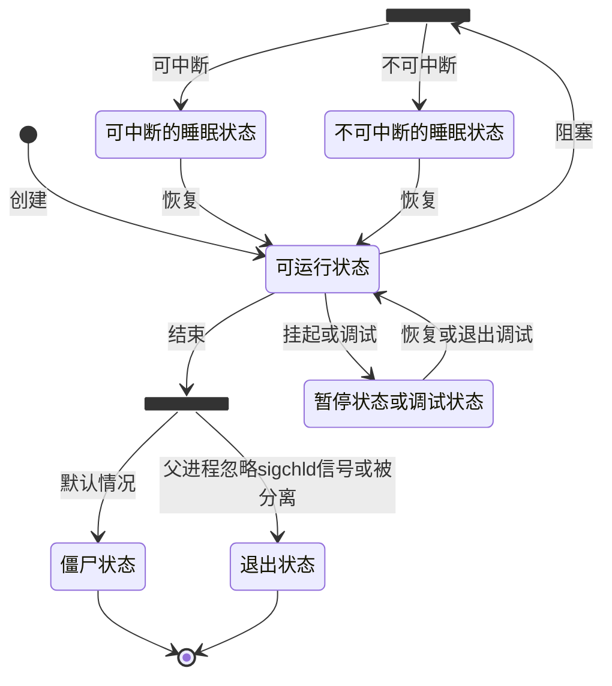

# 进程

> 一个进程的动态形式

## 进程间的通信方式

- 基于通讯

    - 基于数据传递

        - 管道

        - 消息队列

- 基于信号

    - 操作系统的信号Signal

- 基于同步

    - 信号灯

## 父子进程

父进程可以通过fork的方式创建子进程

1. 子进程会获得父进程的数据段，堆和栈的副本，并共享代码段

2. 子进程对于它的副本的修改对其父进程和兄弟进程都是不可见的

3. copy on write是用来提高进程创建效率的

4. 所有的进程共同组成了一个树状结构，内核启动进程作为根

5. 进程标识符（pcb）

## 进程PCB

操作系统存放进程的管理和控制信息的数据结构称为进程控制块

- 程序id

- 特征信息

    区分系统进程，用户进程，内核进程

- 进程状态

- 优先级

- 通信信息

- 现场保护区

    用来保护阻塞的进程

- 资源需求，分配控制信息

- 进程尸体信息

    指明程序路径和名称，进程数据在物理内存还是在交换分页中

- 其他信息

    工作单位，工作区，文件信息

### 进程的状态

- 可运行状态

将要，立刻或正在cpu上运行，由进程调度器决定

- 可中断的睡眠状态

当进程等待某个事件的时候会进入该状态

- 不可中断的睡眠状态

发送给此种状态的进程的信号，得等进程从此状态转出才会被传递到

- 暂停状态或跟踪状态

- 僵尸状态

进程即将结束，绝大多数资源已被回收

- 退出状态

### 进程的状态转化

