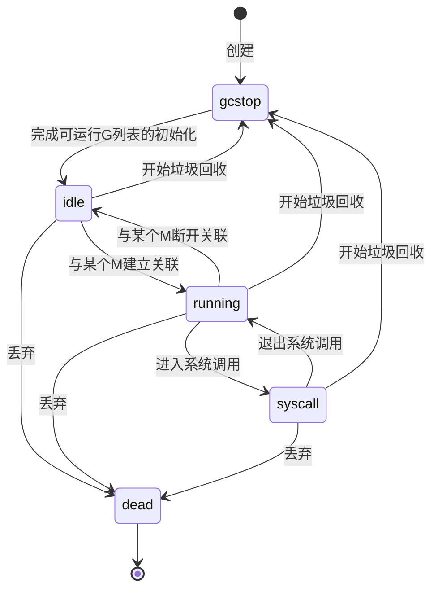
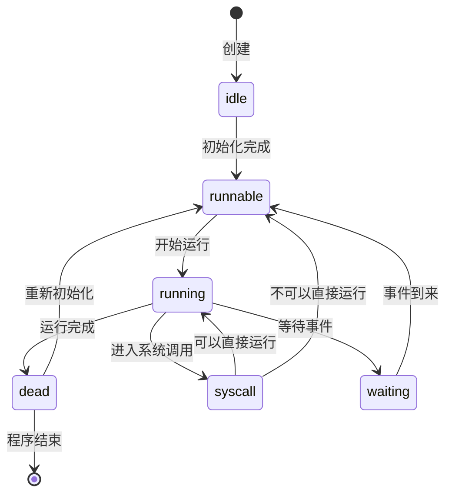

# MPG模型

M: Machine代表一个内核线程
P: Processor代表M所需的上下文环境
G: 代表了一段需要被并发执行的Go语言代码的封装

一个M与一个KSE一一对应

一个P可以与多个M相关联，一个M可以管理多个P

一个P上包含一个可运行的G的队列

### Processor的状态流转

```mermaid
stateDiagram
    [*] --> gcstop: 创建
    gcstop --> idle: 完成可运行G列表的初始化
    idle --> running: 与某个M建立关联
    running --> idle: 与某个M断开关联
    idle --> gcstop: 开始垃圾回收
    running --> gcstop: 开始垃圾回收
    running --> syscall: 进入系统调用
    syscall --> running: 退出系统调用
    idle --> dead: 丢弃
    running --> dead: 丢弃
    syscall --> dead: 丢弃
    syscall --> gcstop: 开始垃圾回收
    dead --> [*]
```

### Goroutine的状态流转

```mermaid
stateDiagram
    [*] --> idle: 创建
    idle --> runnable: 初始化完成
    runnable --> running: 开始运行
    running --> dead: 运行完成
    running --> syscall: 进入系统调用
    syscall --> running: 可以直接运行
    syscall --> runnable: 不可以直接运行
    running --> waiting: 等待事件
    waiting --> runnable: 事件到来
    dead --> runnable: 重新初始化
    dead --> [*]: 程序结束
```
